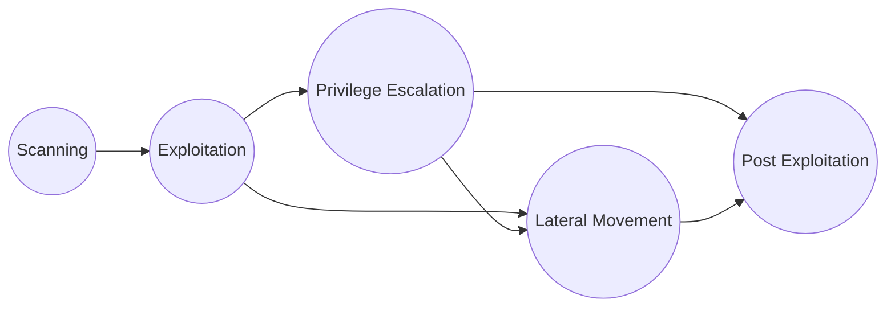

# Command-CheatSheet

## Penetration Testing Flow

---

## Table of Contents

### [1.Scanning](1.Scanning/Port-Scanning.md)

- [Port Scanning Guide](1.Scanning/Port-Scanning.md) - Nmap, Masscan, Rustscan

#### IT Ports

| Port | Service | File |
| :--- | :--- | :--- |
| 7 | Echo | [7-echo.md](1.Scanning/IT-Ports/7-echo.md) |
| 21 | FTP | [21-ftp.md](1.Scanning/IT-Ports/21-ftp.md) |
| 22 | SSH | [22-ssh.md](1.Scanning/IT-Ports/22-ssh.md) |
| 23 | Telnet | [23-telnet.md](1.Scanning/IT-Ports/23-telnet.md) |
| 25 | SMTP | [25-smtp.md](1.Scanning/IT-Ports/25-smtp.md) |
| 43 | WHOIS | [43-whois.md](1.Scanning/IT-Ports/43-whois.md) |
| 49 | TACACS+ | [49-tacacs.md](1.Scanning/IT-Ports/49-tacacs.md) |
| 53 | DNS | [53-dns.md](1.Scanning/IT-Ports/53-dns.md) |
| 69 | TFTP | [69-tftp.md](1.Scanning/IT-Ports/69-tftp.md) |
| 79 | Finger | [79-finger.md](1.Scanning/IT-Ports/79-finger.md) |
| 80, 443 | HTTP/HTTPS | [80-443-http.md](1.Scanning/IT-Ports/80-443-http.md) |
| 88 | Kerberos | [88-kerberos.md](1.Scanning/IT-Ports/88-kerberos.md) |
| 110, 995 | POP3 | [110-995-pop3.md](1.Scanning/IT-Ports/110-995-pop3.md) |
| 111 | RPC | [111-rpc.md](1.Scanning/IT-Ports/111-rpc.md) |
| 113 | Ident | [113-ident.md](1.Scanning/IT-Ports/113-ident.md) |
| 123 | NTP | [123-ntp.md](1.Scanning/IT-Ports/123-ntp.md) |
| 135, 593 | MSRPC | [135-593-msrpc.md](1.Scanning/IT-Ports/135-593-msrpc.md) |
| 139, 445 | SMB | [139-445-smb.md](1.Scanning/IT-Ports/139-445-smb.md) |
| 143, 993 | IMAP | [143-993-imap.md](1.Scanning/IT-Ports/143-993-imap.md) |
| 161, 162 | SNMP | [161-162-snmp.md](1.Scanning/IT-Ports/161-162-snmp.md) |
| 194, 6667 | IRC | [194-6667-irc.md](1.Scanning/IT-Ports/194-6667-irc.md) |
| 389, 636, 3268, 3269 | LDAP | [389-636-3268-3269-ldap.md](1.Scanning/IT-Ports/389-636-3268-3269-ldap.md) |
| 500 | IPsec/IKE | [500-ipsec.md](1.Scanning/IT-Ports/500-ipsec.md) |
| 512-514 | R-Services | [512-514-rservices.md](1.Scanning/IT-Ports/512-514-rservices.md) |
| 515 | LPD | [515-lpd.md](1.Scanning/IT-Ports/515-lpd.md) |
| 548 | AFP | [548-afp.md](1.Scanning/IT-Ports/548-afp.md) |
| 554 | RTSP | [554-rtsp.md](1.Scanning/IT-Ports/554-rtsp.md) |
| 623 | IPMI | [623-ipmi.md](1.Scanning/IT-Ports/623-ipmi.md) |
| 631 | IPP/CUPS | [631-ipp-cups.md](1.Scanning/IT-Ports/631-ipp-cups.md) |
| 873 | Rsync | [873-rsync.md](1.Scanning/IT-Ports/873-rsync.md) |
| 1080 | SOCKS Proxy | [1080-socks.md](1.Scanning/IT-Ports/1080-socks.md) |
| 1099 | Java RMI | [1099-java-rmi.md](1.Scanning/IT-Ports/1099-java-rmi.md) |
| 1414 | IBM MQ | [1414-ibmmq.md](1.Scanning/IT-Ports/1414-ibmmq.md) |
| 1433 | MSSQL | [1433-mssql.md](1.Scanning/IT-Ports/1433-mssql.md) |
| 1521 | Oracle | [1521-oracle.md](1.Scanning/IT-Ports/1521-oracle.md) |
| 1723 | PPTP VPN | [1723-pptp.md](1.Scanning/IT-Ports/1723-pptp.md) |
| 2049 | NFS | [2049-nfs.md](1.Scanning/IT-Ports/2049-nfs.md) |
| 2375, 2376 | Docker | [2375-2376-docker.md](1.Scanning/IT-Ports/2375-2376-docker.md) |
| 3128 | Squid Proxy | [3128-squid.md](1.Scanning/IT-Ports/3128-squid.md) |
| 3260 | iSCSI | [3260-iscsi.md](1.Scanning/IT-Ports/3260-iscsi.md) |
| 3306 | MySQL | [3306-mysql.md](1.Scanning/IT-Ports/3306-mysql.md) |
| 3389 | RDP | [3389-rdp.md](1.Scanning/IT-Ports/3389-rdp.md) |
| 3632 | distcc | [3632-distcc.md](1.Scanning/IT-Ports/3632-distcc.md) |
| 3690 | SVN | [3690-svn.md](1.Scanning/IT-Ports/3690-svn.md) |
| 4222 | NATS | [4222-nats.md](1.Scanning/IT-Ports/4222-nats.md) |
| 4369 | Erlang EPMD | [4369-epmd.md](1.Scanning/IT-Ports/4369-epmd.md) |
| 4786 | Cisco Smart Install | [4786-cisco-smart-install.md](1.Scanning/IT-Ports/4786-cisco-smart-install.md) |
| 5000 | Docker Registry | [5000-docker-registry.md](1.Scanning/IT-Ports/5000-docker-registry.md) |
| 5353 | mDNS | [5353-mdns.md](1.Scanning/IT-Ports/5353-mdns.md) |
| 5432, 5433 | PostgreSQL | [5432-5433-postgresql.md](1.Scanning/IT-Ports/5432-5433-postgresql.md) |
| 5555 | ADB | [5555-adb.md](1.Scanning/IT-Ports/5555-adb.md) |
| 5601 | Kibana | [5601-kibana.md](1.Scanning/IT-Ports/5601-kibana.md) |
| 5672 | AMQP/RabbitMQ | [5672-amqp.md](1.Scanning/IT-Ports/5672-amqp.md) |
| 5900 | VNC | [5900-vnc.md](1.Scanning/IT-Ports/5900-vnc.md) |
| 5984 | CouchDB | [5984-couchdb.md](1.Scanning/IT-Ports/5984-couchdb.md) |
| 5985 | WinRM | [5985-winrm.md](1.Scanning/IT-Ports/5985-winrm.md) |
| 6000 | X11 | [6000-x11.md](1.Scanning/IT-Ports/6000-x11.md) |
| 6379 | Redis | [6379-redis.md](1.Scanning/IT-Ports/6379-redis.md) |
| 8000, 5005 | JDWP | [8000-jdwp.md](1.Scanning/IT-Ports/8000-jdwp.md) |
| 8009 | AJP | [8009-ajp.md](1.Scanning/IT-Ports/8009-ajp.md) |
| 8086 | InfluxDB | [8086-influxdb.md](1.Scanning/IT-Ports/8086-influxdb.md) |
| 8089 | Splunk | [8089-splunk.md](1.Scanning/IT-Ports/8089-splunk.md) |
| 9000 | FastCGI | [9000-fastcgi.md](1.Scanning/IT-Ports/9000-fastcgi.md) |
| 9042, 9160 | Cassandra | [9042-9160-cassandra.md](1.Scanning/IT-Ports/9042-9160-cassandra.md) |
| 9100 | JetDirect | [9100-jetdirect.md](1.Scanning/IT-Ports/9100-jetdirect.md) |
| 9200 | Elasticsearch | [9200-elasticsearch.md](1.Scanning/IT-Ports/9200-elasticsearch.md) |
| 10000 | NDMP | [10000-ndmp.md](1.Scanning/IT-Ports/10000-ndmp.md) |
| 11211 | Memcache | [11211-memcache.md](1.Scanning/IT-Ports/11211-memcache.md) |
| 15672 | RabbitMQ Mgmt | [15672-rabbitmq-mgmt.md](1.Scanning/IT-Ports/15672-rabbitmq-mgmt.md) |
| 27017 | MongoDB | [27017-mongodb.md](1.Scanning/IT-Ports/27017-mongodb.md) |

#### OT Ports (Industrial/SCADA)

| Port | Protocol | File |
| :--- | :--- | :--- |
| 102 | S7comm (Siemens) | [102-s7comm.md](1.Scanning/OT-Ports/102-s7comm.md) |
| 502 | Modbus | [502-modbus.md](1.Scanning/OT-Ports/502-modbus.md) |
| 1883 | MQTT | [1883-mqtt.md](1.Scanning/OT-Ports/1883-mqtt.md) |
| 4840 | OPC UA | [4840-opcua.md](1.Scanning/OT-Ports/4840-opcua.md) |
| 20000 | DNP3 | [20000-dnp3.md](1.Scanning/OT-Ports/20000-dnp3.md) |
| 44818 | EtherNet/IP | [44818-ethernetip.md](1.Scanning/OT-Ports/44818-ethernetip.md) |
| 47808 | BACnet | [47808-bacnet.md](1.Scanning/OT-Ports/47808-bacnet.md) |

### [2.CVE-Exploit](2.CVE-Exploit/)

- [CVE Exploit](2.CVE-Exploit/2.1.CVE-Exploit.md) - Shellshock, Sambacry, Drupalgeddon2, Log4Shell, Ghostcat, and more
- [Buffer Overflow](2.CVE-Exploit/2.2.Buffer-Overflow.md) - Pattern creation, Offset calculation, JMP ESP gadgets, Shellcode generation, Exploit development

### [3.AD-Exploit](3.AD-Exploit/)

- [AD Exploitation](3.AD-Exploit/3.1.AD-Exploitation.md) - PowerView, BloodHound, ASREPRoast, Kerberoasting, DCSync, Golden/Silver Tickets, AD CS, NTLM Relay, Responder, AMSI Bypass
- [Password Attacks](3.AD-Exploit/3.2.Password-Attacks.md) - hashcat, John, Hydra, Kerbrute, mimikatz, NetExec

### [4.Privilege-Escalation](4.Privilege-Escalation/)

- [Privilege Escalation Windows](4.Privilege-Escalation/4.1.Privilege-Escalation-Windows.md) - Potato exploits, PowerUp, winPEAS, DLL Hijacking
- [Privilege Escalation Linux](4.Privilege-Escalation/4.2.Privilege-Escalation-Linux.md) - SUDO, SUID, Capabilities, Cron, Kernel exploits, Docker escape

### [5.Lateral-Movement](5.Lateral-Movement/)

- [Lateral Movement](5.Lateral-Movement/5.1.Lateral-Movement.md) - PsExec, WMI, WinRM, DCOM, Pass-the-Hash, Pass-the-Ticket
- [Pivoting & Tunneling](5.Lateral-Movement/5.2.Pivoting-Tunneling.md) - SSH Port Forwarding, Proxychains, Ligolo-ng, Chisel, sshuttle, Metasploit Pivoting

### [6.OS-Command](6.OS-Command/)

- [Windows Commands](6.OS-Command/6.1.Windows-command.md) - PowerShell, cmd, file transfer, enumeration
- [Linux Commands](6.OS-Command/6.2.Linux-command.md) - File transfer, shell upgrading, networking, utilities
- [Reverse Shell](6.OS-Command/6.3.Reverse-Shell.md) - Bash, Python, PHP, PowerShell, Netcat, Msfvenom, Shell Stabilization
- [Wordlist Guide](6.OS-Command/6.4.Wordlist-Guide.md) - SecLists, Password/Username Wordlists, Service-Specific Lists, Custom Generation

### [7.Web-Exploit](7.Web-Exploit/)

- [Web Application Analysis](7.Web-Exploit/7.0.Web-Application-Analysis.md) - DNS, Subdomain, VHost, Directory Enumeration, Technology Fingerprinting, LFI, XSS, SSTI, SQLi, XXE
- [SQL Injection](7.Web-Exploit/7.1.SQL-Injection.md) - SQLi, SQLMap, Union, Blind, MSSQL, MySQL, PostgreSQL
- [Cross-Site Scripting (XSS)](7.Web-Exploit/7.2.Cross-Site-Scripting.md) - Reflected, Stored, DOM-Based, Cookie Stealing
- [File Inclusion (LFI/RFI)](7.Web-Exploit/7.3.File-Inclusion.md) - Path Traversal, PHP Wrappers, Log Poisoning
- [Command Injection](7.Web-Exploit/7.4.Command-Injection.md) - OS Command Injection, Bypass Techniques
- [SSRF](7.Web-Exploit/7.5.SSRF.md) - Server-Side Request Forgery, Cloud Metadata
- [SSTI](7.Web-Exploit/7.6.SSTI.md) - Server-Side Template Injection, Jinja2, Twig, Freemarker
- [XXE](7.Web-Exploit/7.7.XXE.md) - XML External Entity, OOB, Blind XXE
- [File Upload](7.Web-Exploit/7.8.File-Upload.md) - Bypass Filters, Web Shells, Polyglot Files
- [IDOR & Access Control](7.Web-Exploit/7.10.IDOR-Access-Control.md) - Insecure Direct Object Reference, Broken Access Control
- [CSRF](7.Web-Exploit/7.11.CSRF.md) - Cross-Site Request Forgery, Token Bypass
- [Insecure Deserialization](7.Web-Exploit/7.12.Insecure-Deserialization.md) - PHP, Java (ysoserial), Python Pickle, .NET
- [Git Hacking](7.Web-Exploit/7.13.Git-Hacking.md) - Exposed .git, GitDumper, Secret Extraction

### [8.C2-Framework](8.C2-Framework/)

- [Sliver](8.C2-Framework/8.1.Sliver.md) - Installation, Implant Generation, Listeners, Session Management, Armory Extensions

### [9.OSCP-Exam](9.OSCP-Exam/)

- [OSCP Exam Guide](9.OSCP-Exam/9.1.OSCP-Exam-Guide.md) - Exam Structure, Passing Scenarios, Allowed/Restricted Tools, Screenshot Requirements, Report Submission, Exam Tips, **AD Set Step-by-Step Methodology**

### [10.Mobile-Security](10.Mobile-Security/)

- [Android Pentesting](10.Mobile-Security/10.1.Android-Pentesting.md) - APK Decompilation, apktool, jadx, APK Signing, ADB Commands, Frida SSL Pinning Bypass

### [11.Defensive-Security](11.Defensive-Security/)

- [Network Forensics](11.Defensive-Security/11.1.Network-Forensics.md) - tshark, Wireshark, tcpdump, PCAP Analysis, DNS/HTTP/TLS Analysis, Exfiltration Detection
- [SOC Analysis](11.Defensive-Security/11.2.SOC-Analysis.md) - YARA Rules, File Hash Analysis, Data Decoding, Log Analysis, Threat Intelligence

---

## Useful Tools

| Tool | Description | Primary Use Case |
| :--- | :--- | :--- |
| Evil-WinRM | WinRM shell | Interactive remote shell |
| NetExec | Network attack tool | Authentication and exploitation |
| BloodHound | AD reconnaissance | Domain mapping |
| Rubeus | Kerberos toolkit | Ticket manipulation |
| Mimikatz | Credential extractor | Password and hash dumping |
| PowerView | AD enumeration | Domain reconnaissance |
| Impacket | Network protocols | SMB, Kerberos, WMI attacks |
| Certipy | AD CS attacks | Certificate abuse |
| LinPEAS/winPEAS | Privilege escalation | Enumeration scripts |
| Chisel/Ligolo-ng | Tunneling | Port forwarding and pivoting |
| SQLMap | SQL Injection | Automated SQLi exploitation |
| FFuF | Web fuzzer | Directory/parameter fuzzing |
| tplmap | SSTI exploitation | Template injection automation |
| Gopherus | SSRF exploitation | Generate gopher payloads |

---

## Reference Cheatsheets

| Source | Description | URL |
| :--- | :--- | :--- |
| 0xsyr0/OSCP | Comprehensive OSCP cheatsheet | <https://github.com/0xsyr0/OSCP> |
| TheUnknownSoul CBBH | HTB Bug Bounty Hunter cheatsheet | <https://github.com/TheUnknownSoul/HTB-certified-bug-bounty-hunter-exam-cheetsheet> |
| zagnox CPTS | HTB CPTS cheatsheet | <https://github.com/zagnox/CPTS-cheatsheet> |
| x3m1sec CPTS Notes | CPTS certification notes | <https://x3m1sec.gitbook.io/notes/my-certifications/cpts/notes> |
| s4thv1k OSCP | OSCP exam cheatsheet | <https://s4thv1k.com/posts/oscp-cheatsheet/> |
| noobsec OSCP | OSCP cheatsheet | <https://www.noobsec.net/oscp-cheatsheet/> |
| noobsec AD | Active Directory cheatsheet | <https://www.noobsec.net/ad-cheatsheet/> |
| CountablyInfinite OSCP | OSCP cheatsheet collection | <https://github.com/CountablyInfinite/oscp_cheatsheet> |
| dise0 H4cker Book | Hacking notes | <https://dise0.gitbook.io/h4cker_b00k> |
| hackviser | Pentest cheatsheets | <https://hackviser.com> |
| HackTricks | Comprehensive hacking wiki | <https://book.hacktricks.xyz/> |
| PayloadsAllTheThings | Payload collection | <https://github.com/swisskyrepo/PayloadsAllTheThings> |
| GTFOBins | Unix binaries exploitation | <https://gtfobins.github.io/> |
| LOLBAS | Windows binaries exploitation | <https://lolbas-project.github.io/> |
| WADCOMS | Windows/AD cheatsheet | <https://wadcoms.github.io/> |
